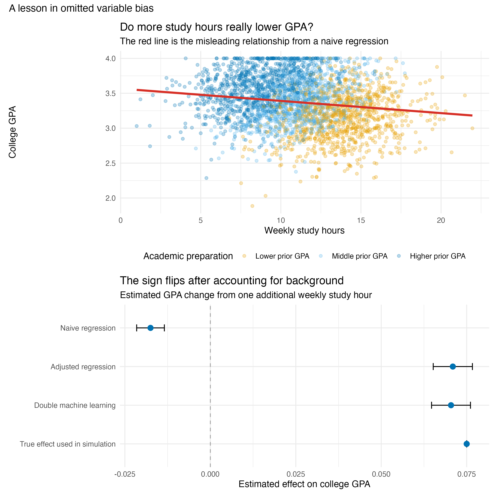

Students are usually told that studying more leads to better grades. Yet a simple regression can tell the opposite story. In my simulated dataset of 3,000 students, one additional hour of weekly study is associated with a **0.018-point decrease** in college GPA. Should students close their textbooks?

Not so fast. This surprising result illustrates **omitted variable bias**: a regression coefficient can absorb the influence of an important variable that was left out of the model.

## How the Data Were Simulated

I generated 3,000 fictional students using a fixed random seed. Each student was assigned a high school GPA, attendance rate, sleep duration, stress level, weekly study time, and college GPA. Study time was designed to be higher among students with weaker prior preparation or lower attendance. College GPA was designed to increase with both prior preparation and study time: before applying the 0–4 GPA boundary, one additional weekly study hour contributed 0.075 points. Random noise ensured that students with similar backgrounds did not receive identical outcomes.

This design deliberately creates confounding for illustration. It shows how omitted variable bias can arise, but it does not estimate the real-world effect of studying.

## A Misleading First Impression

I simulated students' weekly study hours and college GPAs, together with four background characteristics: high school GPA, attendance, sleep, and stress. The simulation deliberately represents a plausible pattern: students with weaker academic preparation tend to study longer because they need more time to master the same material. At the same time, prior preparation directly predicts college GPA.

The complete analysis is available in the [reproducible R script](bp1_gpa_ovb.R), and the [simulated dataset](bp1_gpa_simulated_data.csv) contains no real student records.

```{r}
#| eval: false
#| code-fold: true

naive_model <- lm(college_gpa ~ study_hours, data = students)

adjusted_model <- lm(
  college_gpa ~ study_hours + high_school_gpa + attendance +
    sleep_hours + I((sleep_hours - 7)^2) + stress + I(stress^2),
  data = students
)
```

{fig-alt="A scatterplot of study hours and college GPA followed by a coefficient plot comparing naive regression, adjusted regression, double machine learning, and the true simulated effect."}

The red line in the upper panel slopes downward. However, the colors reveal what that line hides: students with lower high school GPAs are concentrated toward the right because they generally study longer, while students with stronger preparation can earn high college GPAs with fewer hours.

## Where the Bias Comes From

Let $Y$ be college GPA, $D$ be study hours, and $A$ be prior academic preparation. The relationship of interest is

$$Y = \beta D + \gamma A + \varepsilon.$$

If preparation is excluded, its influence does not disappear. Instead, some of it enters the estimated coefficient on study hours. Here, preparation raises college GPA but is negatively related to study time. The naive regression therefore mixes the positive effect of studying with the negative association between studying and prior preparation.

Once I control for observed student characteristics, the estimated effect changes from **−0.018** to **+0.071 GPA points per additional weekly study hour**. The comparison is now between students with similar backgrounds rather than between fundamentally different students.

## Where Double Machine Learning Enters

An ordinary regression requires the analyst to specify how every control variable enters the model. That becomes difficult when there are many controls or nonlinear relationships. **Double machine learning (DML)** uses flexible prediction models to remove the part of both GPA and study time that can be explained by the observed background variables.

First, a machine-learning model predicts GPA from the controls. A second model predicts study hours from the same controls. DML then relates the two sets of unexplained residuals. I used XGBoost with five-fold **cross-fitting**, so each student's residual was produced by a model that was trained on other students. This reduces the risk that overfitting contaminates the final estimate.

The DML estimate is **+0.070**, with a 95% confidence interval from **+0.065 to +0.076**. It is close to both the adjusted regression estimate and the true effect of +0.075 used to generate the data.

## What DML Cannot Do

DML is not a machine that automatically discovers causality. It can flexibly adjust for variables that were measured, but it cannot recover information that was never recorded. If motivation or family support affects both study time and GPA but is absent from the data, the estimate may still be biased.

The larger lesson is simple: a regression coefficient does not interpret itself. Before concluding that studying lowers GPA—or that any behavior causes an outcome—we should ask who is being compared and which relevant differences have been left out.
