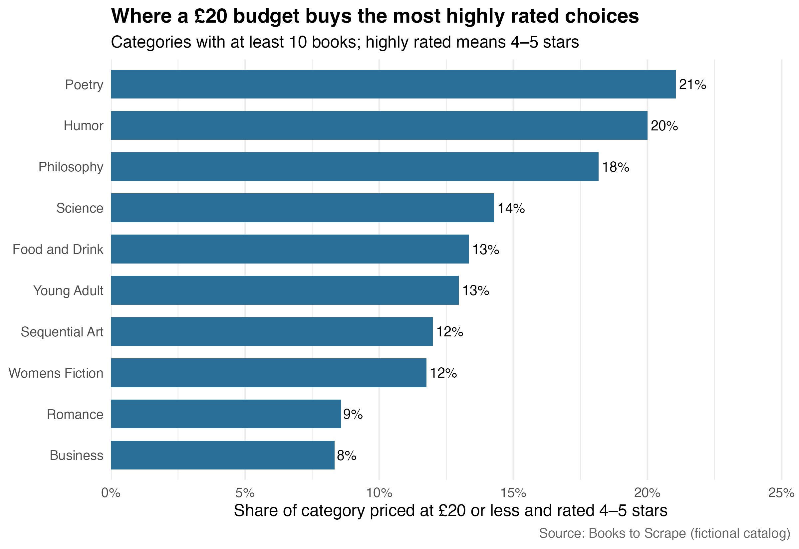

``` r
library(dplyr)
library(readr)
library(ggplot2)
library(scales)
library(knitr)

books <- read_csv("data/books.csv", show_col_types = FALSE)
category_summary <- read_csv("data/category_summary.csv", show_col_types = FALSE)
recommendations <- read_csv("data/recommendations.csv", show_col_types = FALSE)
```

## The question

Online stores offer thousands of choices, but a low sticker price is not necessarily a good value. A reader with a £20 ceiling probably wants both affordability and some evidence of quality. I therefore asked: **Which book categories give a budget-conscious shopper the best chance of finding a highly rated book for £20 or less?**

The data come from [Books to Scrape](https://books.toscrape.com/), a fictional bookstore created specifically for web-scraping practice. Because the site is a sandbox rather than a real retailer, the exercise is ethical and reproducible; no login, CAPTCHA, or access restriction is bypassed. The prices and ratings are fictional, so the recommendation demonstrates a decision method rather than advice about today’s real book market.

## Collecting and cleaning the catalog

I used [`rvest`](https://rvest.tidyverse.org/) to read the home page and extract links to every category. The scraper then visited each category page, followed its “next” link, and paused 0.35 seconds between requests. From every product card it collected the full title, price, star-rating class, stock status, and URL. The complete scraping code is in [`scrape_analyze.R`](scrape_analyze.R); its core extraction step is shown below.


``` r
page <- read_html(url)
cards <- html_elements(page, "article.product_pod")

tibble(
  title = html_attr(html_element(cards, "h3 a"), "title"),
  price_gbp = parse_number(html_text2(html_element(cards, ".price_color"))),
  rating_word = str_remove(
    html_attr(html_element(cards, "p.star-rating"), "class"),
    "star-rating\\s+"
  )
)
```

The rating words (“One” through “Five”) were converted to integers, pound signs were removed from prices, and duplicate product URLs were dropped. Validation checks require exactly 1,000 books and no missing prices or ratings. I defined a **budget-quality book** as one rated four or five stars and priced at no more than £20. To avoid a misleading win by a tiny niche, category comparisons include only categories containing at least 10 books.

## Results

Across the catalog, 1000 books appeared in 50 categories. 7.5% of all books met both the quality and price thresholds. The figure ranks the ten strongest eligible categories by the share of their inventory that met both conditions.

<div class="figure">

<p class="caption">Budget-quality availability by category.</p>
</div>


``` r
category_summary |>
  slice_head(n = 5) |>
  transmute(
    Category = category,
    Books = books,
    `Median price` = dollar(median_price_gbp, prefix = "£"),
    `Average rating` = round(average_rating, 2),
    `Budget-quality share` = percent(budget_quality_share, accuracy = 1)
  ) |>
  kable(align = c("l", "r", "r", "r", "r"))
```


|Category       | Books| Median price| Average rating| Budget-quality share|
|:--------------|-----:|------------:|--------------:|--------------------:|
|Poetry         |    19|       £38.77|           3.53|                  21%|
|Humor          |    10|       £31.29|           3.40|                  20%|
|Philosophy     |    11|       £29.93|           2.36|                  18%|
|Science        |    14|       £30.02|           2.93|                  14%|
|Food and Drink |    30|       £31.83|           2.90|                  13%|

Poetry ranks first: 21% of its listings clear both hurdles, compared with 8% catalog-wide. Its median price is £38.77. A shopper who is flexible about genre should start there, then compare the next few categories in the table. Someone choosing a specific title can use the generated [`recommendations.csv`](data/recommendations.csv), which sorts in-stock qualifying books by rating and then price.

This ranking is descriptive, not a claim that price causes ratings or that star ratings measure literary merit. Books to Scrape also provides no review counts, so a five-star item cannot be weighted by the amount of feedback behind it. Different cutoffs would change the ranking; £20 and four stars simply make the shopping rule explicit and easy to revise in the script.

## Takeaway

Web scraping becomes useful when it is tied to a decision rule. Here, [`rvest`](https://rvest.tidyverse.org/) transformed paginated product cards into a clean catalog, while a combined price-and-quality threshold turned that catalog into a browsing recommendation. For a £20 shopper in this simulated store, begin with **Poetry**, where the probability of finding an affordable, highly rated option is greatest among categories with a meaningful selection. The same workflow could be reused on a permitted real catalog—after checking its terms and `robots.txt`—to guide an actual purchase.

## Related research

This project is a small-scale example of a broader use of web-scraped prices in economic research. [Cavallo and Rigobon’s](https://www.nber.org/papers/w22111) Billion Prices Project collected online prices to construct daily inflation indexes across multiple countries. Their research shows that web data can supplement traditional price statistics by providing information more frequently. In another study, [Aparicio and Cavallo](https://www.nber.org/papers/w24275) used scraped supermarket prices to examine how price controls affected inflation, product availability, and price dispersion in Argentina. The present analysis asks a simpler consumer-level question, but it follows the same general process: collect online product information, create a transparent comparison measure, and translate the results into a practical decision.
