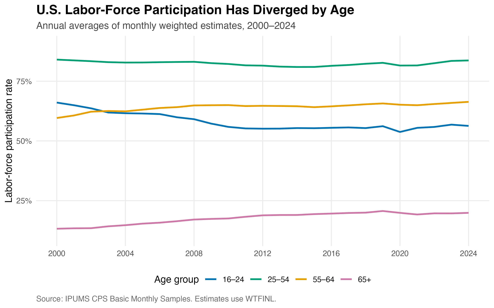
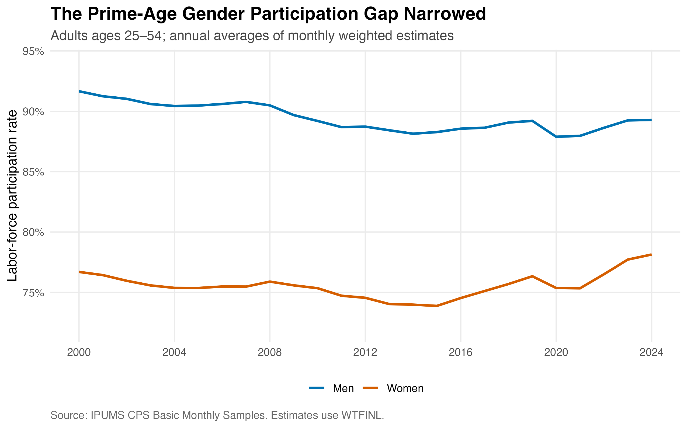
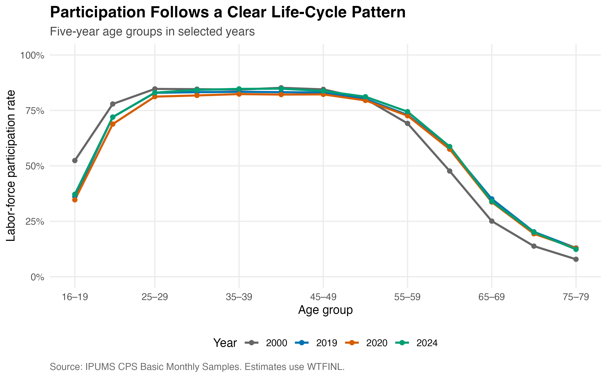

## A changing labor force

The U.S. labor-force participation rate measures the share of the civilian population that is either employed or actively looking for work. Unlike the unemployment rate, it also captures decisions to enter or leave the labor market. This post asks how participation changed from 2000 to 2024 and whether those changes differed across age and gender groups. The results reveal three connected trends: participation fell substantially among young people, rose among older adults, and became more similar for prime-age men and women.

## Data and method

I use IPUMS Current Population Survey (CPS) Basic Monthly Samples from January 2000 through December 2024. The sample includes civilians age 16 and older whose labor-force status is defined. An individual is counted as participating when `LABFORCE` equals 2. Every estimate uses the final Basic Monthly person weight, `WTFINL`, so the results describe the represented U.S. population rather than only the downloaded observations.

I first calculate a weighted participation rate separately for every month and demographic group. I then average the 12 monthly rates to produce each annual estimate. This gives every month equal influence on the annual number. The extract also contained ASEC supplement records, which I excluded to avoid mixing them with the Basic Monthly samples.

The analysis ends in 2024 because it is the most recent year in the extract with complete January–December coverage. I exclude 2025 and 2026 because comparing partial-year estimates with full-year averages could introduce seasonal differences.

```{r}
# Core weighting procedure used after reading the IPUMS extract
monthly_lfpr <- cps |>
  filter(AGE >= 16, LABFORCE %in% c(1, 2)) |>
  group_by(YEAR, MONTH, age_group) |>
  summarize(
    lfpr = weighted.mean(LABFORCE == 2, WTFINL, na.rm = TRUE),
    .groups = "drop"
  )

annual_lfpr <- monthly_lfpr |>
  group_by(YEAR, age_group) |>
  summarize(lfpr = mean(lfpr), .groups = "drop")
```

## Participation moved in opposite directions across ages

{fig-alt="Line chart showing declining participation for ages 16 to 24, stable high participation for ages 25 to 54, and rising participation for both older age groups."}

The age-group trends are strikingly different. Participation among people ages 16–24 fell from 66.0% in 2000 to 56.3% in 2024, a decline of 9.8 percentage points. The series reached its lowest point, 53.7%, in 2020. In contrast, participation among people ages 55–64 increased from 59.6% to 66.3%. Participation among adults age 65 and older also rose, from 13.2% to 19.9%, although it peaked at 20.7% in 2019. Prime-age participation was comparatively stable: the rate for ages 25–54 was 84.0% in 2000 and 83.7% in 2024.

## The prime-age gender gap narrowed

{fig-alt="Line chart showing a persistent but narrowing gap between the participation rates of prime-age men and women."}

Among adults ages 25–54, men continued to participate at a higher rate than women, but the difference became smaller. The gap declined from 15.0 percentage points in 2000 to 11.1 points in 2024. Male participation fell from 91.7% to 89.3%, while female participation rose from 76.7% to 78.1%. Both series dropped during economic downturns, including 2020, but the longer-run convergence is clear.

## The life-cycle curve shifted most at the edges

{fig-alt="Life-cycle profiles showing high participation through prime working ages, lower youth participation than in 2000, and higher participation among older adults."}

The age profiles show that participation remains highest from the late twenties through the early fifties. The largest changes occurred outside those prime working ages. For ages 16–19, participation fell from 52.4% in 2000 to 37.2% in 2024. For ages 65–69, it rose from 25.1% to 34.0%. These shifts are consistent with longer schooling at younger ages and longer working lives at older ages, although the descriptive CPS evidence alone cannot establish those explanations as causal.

## Takeaway

The national labor-force participation rate conceals major differences across demographic groups. Between 2000 and 2024, younger people became less likely to participate, older adults became more likely to work or seek work, and the prime-age gender gap narrowed. Age composition and group-specific behavior therefore matter when interpreting changes in the aggregate labor market.

Data source: [IPUMS CPS](https://cps.ipums.org/cps/). Complete reproduction code is available in the [GitHub repository](https://github.com/sijiexu-jennifer/jenniferxu-website/tree/main/blog/posts/post3), including the [data-processing script](scripts/01_process_cps.py) and [figure script](scripts/02_make_figures.R).
