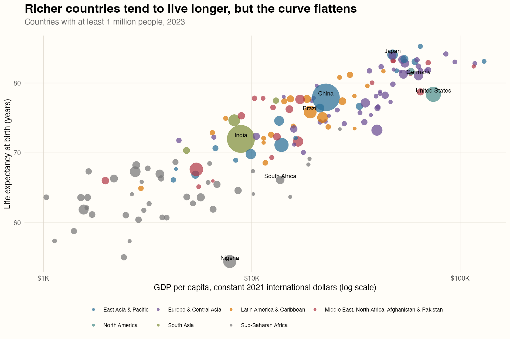
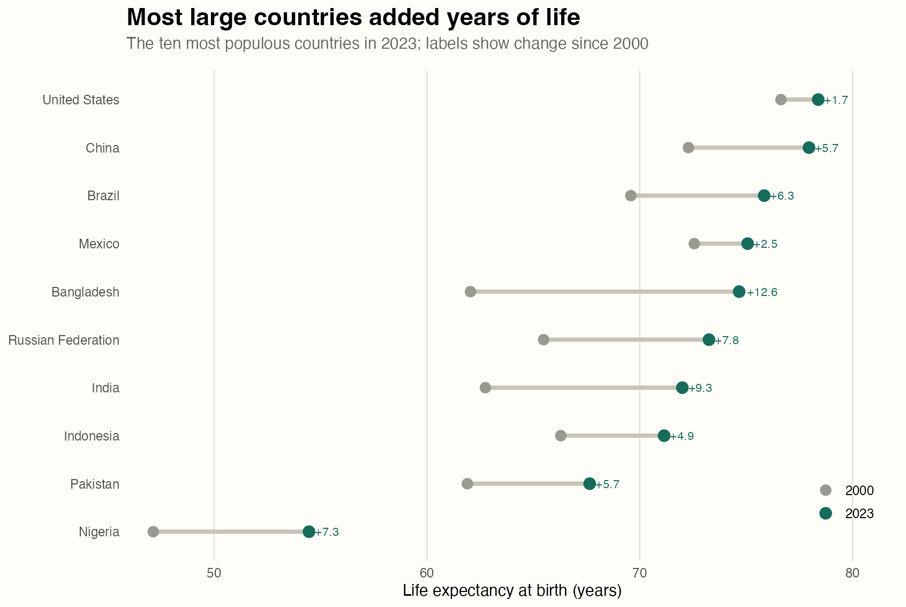
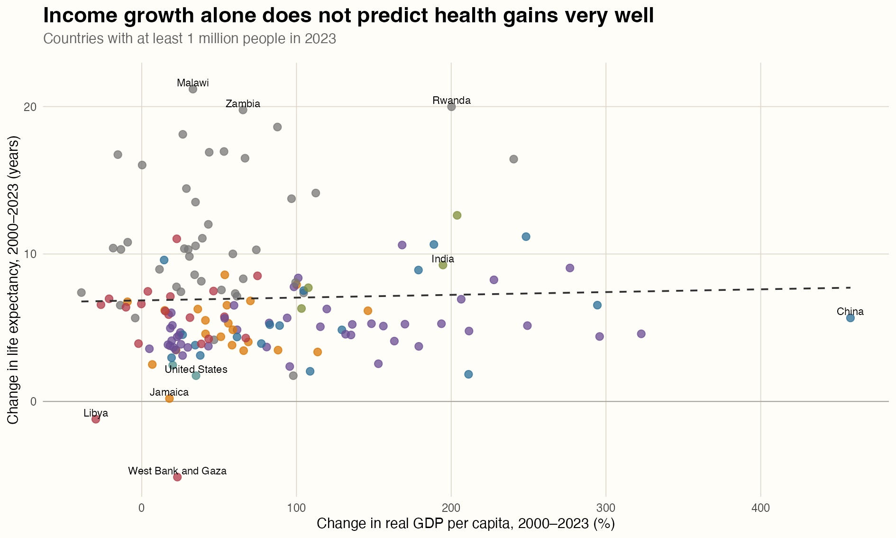

## Income and health

Money seems to buy longer lives, but only up to a point. Across 153 countries in 2023, richer countries generally had higher life expectancy. Yet countries that experienced the fastest economic growth since 2000 did not necessarily make the largest gains in longevity. Using World Bank data, I examine how the relationship differs when countries are compared at one point in time versus followed over time.This question matters because rising income is often treated as a sign that people’s lives are improving. But if countries can become richer without seeing similar gains in life expectancy, income alone may not tell us enough about their progress.

## Data and method

I use three indicators from the [World Bank World Development Indicators](https://databank.worldbank.org/source/world-development-indicators): life expectancy at birth, total population, and GDP per capita at purchasing-power parity. GDP is measured in constant 2021 international dollars. This adjusts for inflation and differences in price levels, making cross-country and over-time comparisons more meaningful than values measured in current U.S. dollars.

The data were downloaded through the official World Bank API with the `WDI` R package. I compare 2000 with 2023, the latest year with broad coverage across all three measures. World Bank regional aggregates are removed. For the scatterplots, I keep countries with at least one million residents in 2023 so that very small economies do not dominate the visual comparison. The repository preserves the raw download, metadata, validation results, cleaned data, and complete R scripts.

```{r}
# Download the indicators from the World Bank API
wdi_raw <- WDI(
  country = "all",
  indicator = c(
    gdp_per_capita = "NY.GDP.PCAP.PP.KD",
    life_expectancy = "SP.DYN.LE00.IN",
    population = "SP.POP.TOTL"
  ),
  start = 2000,
  end = 2023,
  extra = TRUE
)

panel <- wdi_raw |>
  filter(region != "Aggregates") |>
  arrange(country, year)
```

## Richer countries tend to live longer

{fig-alt="A scatterplot showing a strong positive but flattening relationship between GDP per capita and life expectancy across countries in 2023."}

The first figure shows a strong positive relationship between income and life expectancy. Across the 153 countries in the 2023 sample, the correlation between log GDP per capita and life expectancy is 0.88. However, the pattern begins to flatten at higher income levels. Moving from a low-income to a middle-income country is associated with a large difference in life expectancy, while income differences among wealthier countries are associated with much smaller gaps.

The colors also show that countries from the same region tend to cluster together. Regional differences explain part of the overall pattern, but they do not fully account for it: income and life expectancy are still positively related within most regions.

The United States stands out. Although it has one of the highest levels of GDP per capita, its life expectancy is lower than that of several less wealthy countries. This suggests that economic resources can support better health, but higher income does not automatically translate into longer lives.

```{r}
latest <- panel |>
  filter(year == 2023, population >= 1e6) |>
  drop_na(gdp_per_capita, life_expectancy)

ggplot(latest, aes(gdp_per_capita, life_expectancy)) +
  geom_point(aes(size = population, color = region), alpha = 0.72) +
  scale_x_log10(labels = scales::label_dollar()) +
  labs(
    x = "GDP per capita, constant 2021 international dollars",
    y = "Life expectancy at birth (years)"
  )
```

## Progress differed across large countries

{fig-alt="A dumbbell chart showing increases in life expectancy for each of the ten most populous countries between 2000 and 2023."}

Life expectancy increased in all ten of the most populous countries between 2000 and 2023, although the size of the increase varied considerably. The median gain was 6.0 years. Bangladesh gained about 12.6 years and India gained about 9.3 years, while the United States gained only about 1.7 years. These differences show that improvements in health were far from equal across countries.

## Growth alone does not explain health gains

{fig-alt="A scatterplot showing little relationship between GDP per capita growth and gains in life expectancy from 2000 to 2023."}

The third figure shows almost no relationship between income growth and improvements in life expectancy. Across 151 countries, the correlation is only 0.04, meaning that the countries with the fastest economic growth were not necessarily the ones with the largest gains in longevity. China, for example, experienced rapid income growth but a more moderate increase in life expectancy, while several African countries added many years of life with much smaller increases in income.

One possible explanation is that health improvements do not always require equally large increases in national income. In countries starting with lower life expectancy, wider access to vaccines, clean water, basic medical care, and maternal health services can produce substantial gains. Countries already near the top have less room to improve. Economic growth may also be concentrated among certain industries or groups, so a higher GDP does not automatically mean that most people receive better health care. The figure therefore suggests that how resources are used may matter as much as how quickly the economy grows.

```{r}
changes <- panel |>
  filter(year %in% c(2000, 2023)) |>
  pivot_wider(
    names_from = year,
    values_from = c(gdp_per_capita, life_expectancy)
  ) |>
  mutate(
    gdp_growth_pct =
      (gdp_per_capita_2023 / gdp_per_capita_2000 - 1) * 100,
    life_gain = life_expectancy_2023 - life_expectancy_2000
  )

cor(changes$gdp_growth_pct, changes$life_gain, use = "complete.obs")
```

## Questions for future research

These figures show patterns rather than causal relationships. Two possible explanations could be examined with additional data:

- **Public-health investment:** Countries that spend more on basic health services may be better able to turn economic growth into longer lives.
- **Income inequality:** When the benefits of growth are concentrated among a small share of the population, improvements in national income may not lead to better health for everyone.

Future research could test these ideas using data on health spending, vaccination, clean-water access, and income inequality.

## Takeaway

The figures tell a more complicated story than “richer countries live longer.” Income and life expectancy are closely related, especially among low- and middle-income countries, but the relationship becomes weaker at higher income levels. Looking across time, the countries with the fastest economic growth did not consistently achieve the largest gains in life expectancy. Economic growth can provide resources for better health, but improvements also depend on access to medical care, public-health programs, and how widely the benefits of growth are shared. GDP per capita is therefore a useful measure of development, but it does not tell the whole story.

## Data and reproducibility

The data come from the [World Bank World Development Indicators](https://databank.worldbank.org/source/world-development-indicators) and were downloaded through the official API using the `WDI` R package. The repository includes the [data-download script](scripts/01_download_data.R), the [analysis and figure script](scripts/02_make_figures.R), the saved data, and all three figures. The results are descriptive and should not be interpreted as causal estimates.